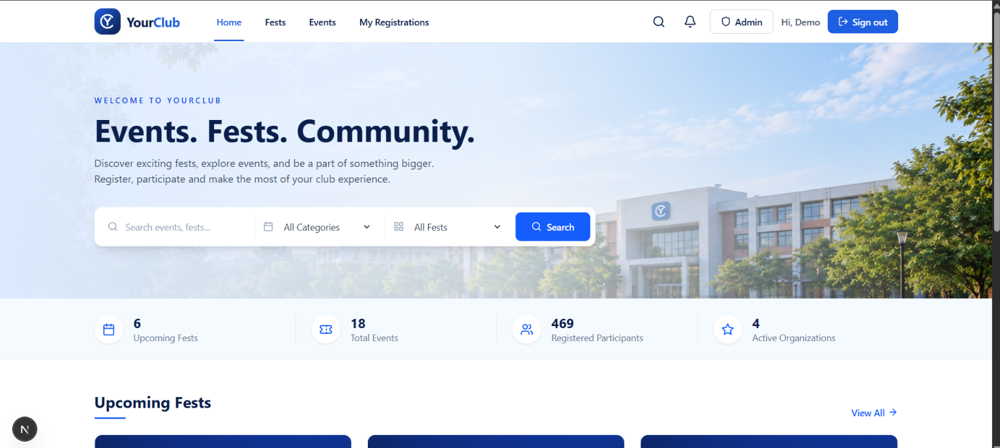

# YourClub

> Events. Fests. Community.

## 1. Project Description

YourClub is a web platform for college clubs to publish fests and events, and for students to discover and register for them. Students browse fests and events, register in a few clicks, and get a digital ticket with a QR code. Club organizers (admins) manage fests, events, participants and users from a dedicated admin panel.

It was built for **DRMC** (clubs such as the IT Club, Robotics Society and Science Club) to replace paper forms and scattered spreadsheets with one place for registration, capacity control and attendance tracking.

## 2. Features

**For students**
- Sign up / log in with **email and password or with a Google account**
- Browse upcoming fests and events, with search and category filters
- Event pages with venue, schedule, fee, live seat availability and registration deadline countdown
- One-click registration with automatic **waitlist** when an event is full
- Digital ticket with **QR code**, downloadable as a file
- "Add to Google Calendar" link for every registered event
- My Registrations page with the option to cancel
- In-app notifications (registration confirmed / cancelled) with unread badge and "mark all as read"

**For admins**
- Dashboard with totals, a 14-day registration trend chart, registrations by status and most popular events
- Create, edit and delete **fests** and **events**
- Per-event participant list with status management
- CSV export of participants *(verify this works before submitting)*
- Check-in tracking
- Users page: search all accounts, see their registrations, and delete an account
- Role-based access: admin pages and actions are protected both in the app and in the database (Row Level Security)

## 3. Tech Stack

| Area | Technology |
|---|---|
| Framework | Next.js 16 (App Router, Turbopack), React 19 |
| Language | TypeScript |
| Styling | Tailwind CSS 4 |
| Database and Auth | Supabase (PostgreSQL, Row Level Security, Supabase Auth with email/password and Google OAuth) |
| Supabase client | `@supabase/supabase-js`, `@supabase/ssr` |
| UI libraries | `lucide-react` (icons), `clsx`, `date-fns` |
| Extras | `qrcode.react` (QR tickets), `papaparse` (CSV export) |
| Hosting | **TODO:** e.g. Vercel |

## 4. Setup Instructions

**Requirements:** Node.js 20 or newer, npm, and a free [Supabase](https://supabase.com) account.

1. **Clone and install**
   ```bash
   git clone <your-repo-url>
   cd yourclub
   npm install
   ```

2. **Create a Supabase project**, then open **SQL Editor** and run, in this order:
   - `supabase/schema.sql` (tables, policies, triggers, views)
   - `supabase/seed.sql` (demo organizations, fests and events)

   > **TODO:** these two files must be added to the repository before submission.

3. **Create the environment file** `.env.local` in the project root:
   ```env
   NEXT_PUBLIC_SUPABASE_URL=your-project-url
   NEXT_PUBLIC_SUPABASE_ANON_KEY=your-anon-key
   SUPABASE_SERVICE_ROLE_KEY=your-service-role-key
   ```
   - URL and keys are in Supabase: **Project Settings → API**.
   - `SUPABASE_SERVICE_ROLE_KEY` is used only on the server (to delete user accounts). Never expose it or commit it.

4. **Create the demo accounts** in Supabase: **Authentication → Users → Add user** (use the emails in section 6, tick "Auto Confirm User"). Then make the admin an admin:
   ```sql
   update public.profiles set role = 'admin' where email = 'admin@yourclub.dev';
   admin login:  "admin@yourclub.dev", password: "Admin@12345"
   ```

5. **(Optional) Enable Google login.** Email/password login works without this step; the "Continue with Google" button only works after it is configured.
   1. In [Google Cloud Console](https://console.cloud.google.com), configure the **OAuth consent screen** (External, scopes `email`, `profile`, `openid`) and set it to **In production** so any Google account can sign in.
   2. Go to **Credentials → Create Credentials → OAuth client ID → Web application**.
      - Authorized JavaScript origins: `http://localhost:3000` (and your live URL after deployment)
      - Authorized redirect URI: the **Callback URL** shown on the Google provider page in Supabase (`https://<project-ref>.supabase.co/auth/v1/callback`)
   3. In Supabase: **Authentication → Sign In / Providers → Google**, enable it and paste the **Client ID** and **Client secret**.
   4. In Supabase: **Authentication → URL Configuration**, set **Site URL** to `http://localhost:3000` and add `http://localhost:3000/**` to **Redirect URLs** (add your live URL too after deployment).

   The Google Client ID and secret are stored in Supabase, not in `.env.local`, so no extra environment variable is needed.

6. **Run the app**
   ```bash
   npm run dev
   ```
   Open http://localhost:3000

**Production build:** `npm run build` then `npm start`.

## 5. Deployment URL

**TODO:** https://your-app.vercel.app

After deploying, add this URL in two places so Google login works on the live site:
- Google Cloud: **Authorized JavaScript origins**
- Supabase: **Site URL** and **Redirect URLs** (`https://your-app.vercel.app/**`)

Also add the three environment variables from step 3 to the hosting provider's settings.

## 6. Demo Credentials

| Role | Email | Password |
|---|---|---|
| Admin | `admin@yourclub.dev` | `Admin@12345` |
| Student | `user@yourclub.dev` | `User@12345` |

The admin panel is at `/admin`. Admin access is only available through the demo admin account above: accounts created with Google (or normal sign up) are always students.

## 7. Third-party Services / APIs

| Service | Used for |
|---|---|
| [Supabase](https://supabase.com) | PostgreSQL database, authentication, Row Level Security, server-side user management |
| Google OAuth (Google Cloud, "Sign in with Google") | Logging in and signing up with a Google account, handled through Supabase Auth |
| Google Calendar (URL template link) | "Add to Google Calendar" button; no API key or login needed |
| **TODO:** hosting provider | e.g. Vercel |

No paid services are required to run the project.

## 8. AI Tools / Features Used

AI tools were used during development, as follows:

- **Claude (Anthropic)**: help with planning features, writing and debugging code (for example the notifications page, admin event/fest management, users list and account deletion, Google sign-in) and this README.
- **TODO:** add every other AI tool you used (for example Cursor, ChatGPT, GitHub Copilot) and what you used it for. List only what you actually used.

All AI-generated code was reviewed, tested and integrated by the project author.

The application itself does not call any AI service at runtime.

## 9. Screenshots

**TODO:** save images in `docs/screenshots/` and keep the file names below (or change the links).

| Page | Screenshot |
|---|---|
| Home |  |
| Login with Google button |  |
| Events list |  |
| Event details and registration |  |
| Ticket with QR code |  |
| My registrations |  |
| Notifications |  |
| Admin dashboard |  |
| Admin events and participants |  |
| Admin users |  |

## 10. Known Limitations

*(Edit this list so it matches the final project.)*

- No online payment: the event fee is shown for information only.
- Notifications are in-app only; no email or SMS is sent.
- Google is the only social login provider.
- Google login needs your own Google Cloud OAuth credentials; without them only email/password login works.
- Accounts created with Google may not have student ID, phone or department filled in. **TODO:** confirm after testing and describe exactly what the user is asked to fill in (for example during their first registration).
- Deleting a user removes the account but does not block the same email from signing up again (no ban list).
- Admin roles can only be changed directly in the database; there is no role-management screen.
- Deleting a fest or event can affect the registrations linked to it.
- Times are entered and shown in Bangladesh time (Asia/Dhaka).
- Designed mainly for desktop and mobile browsers; not tested on older browsers.
- **TODO:** add anything else you know is unfinished.

## 11. License

**TODO:** choose a license and add a `LICENSE` file. For a student project, MIT is a common choice:

```
MIT License. See the LICENSE file for details.
```

## 12. Project Structure

```
src/
├── app/
│   ├── (auth)/          login, signup
│   ├── (public)/        home, fests, events, registration, notifications
│   ├── admin/           dashboard, fests, events, participants, users
│   ├── auth/callback/   Google OAuth callback
│   └── api/             registration and export routes
├── components/          admin, auth, events, fests, home, layout, registration, ui
├── hooks/               custom React hooks
├── lib/                 Supabase clients, queries, helpers, constants
└── types/               shared TypeScript types
```

## 13. Final Decision

The organizing authority reserves the right to make the final decision on rule interpretation, eligibility, judging, scoring and any matter not explicitly covered by the guidelines. All decisions made by the judging panel and the organizing authority are final.